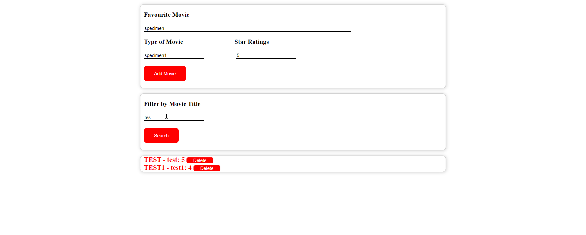

Movie Management APP
You need to create a UI where there will be four input fields for movie name/type/ ratings and filter movie. 
Your application must get all the data from user and display the same on UI as per the given output.
Also there must be a delete button to remove the entry from UI. Your search filter must work and show only the matching data.

